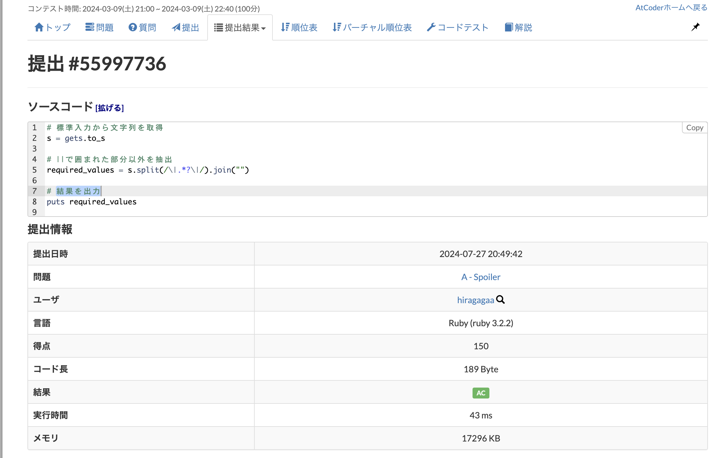
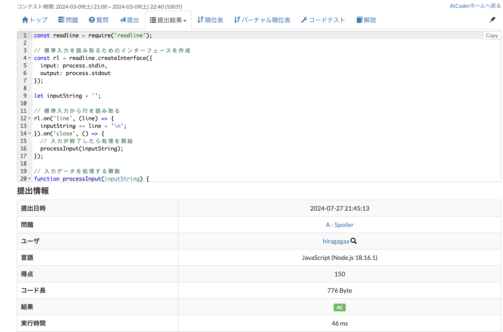
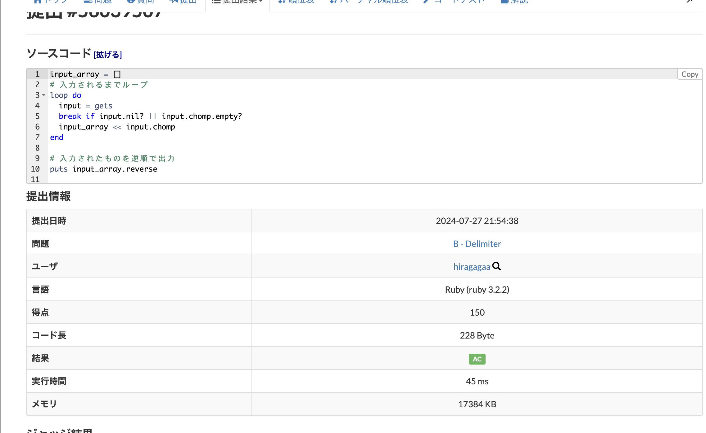
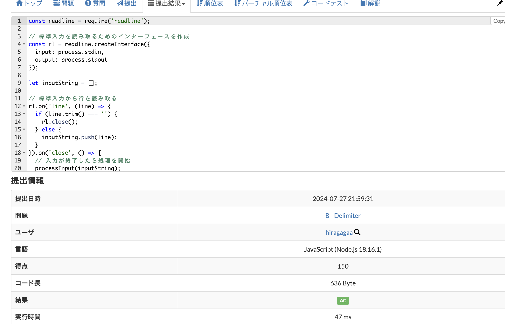

# A問題
https://atcoder.jp/contests/abc344/tasks/abc344_a
## ruby

memo
    splitメソッドの特性として、
    区切り文字に選択した値は削除されることから、
    削除したい文字列を区切り文字に指定することで、
    その文字列を削除した配列を作ることができる
## javascript 

# B問題
https://atcoder.jp/contests/abc344/tasks/abc344_b
## ruby

## javascript 

