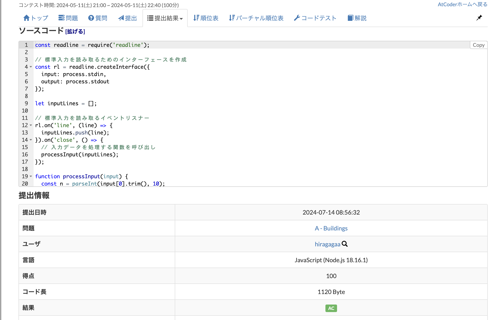

# ruby
## A問題
https://atcoder.jp/contests/abc353/tasks/abc353_a


## B問題
https://atcoder.jp/contests/abc353/tasks/abc353_b


# javascript 
## A問題
https://atcoder.jp/contests/abc353/tasks/abc353_a

### メモ
readlineモジュールは、Node.jsの標準ライブラリの一部です。  
このモジュールを使うと、標準入力（stdin）やファイルから一行ずつデータを読み取ることができます。  
require('readline')は、readlineモジュールをインポートし、変数readlineに格納します。  

lineイベント
```
function (line) {}

input ストリームから \n を読み込むごとに生成されます。 
ユーザーが入力した一行がEnterキーで確定されるたびに、指定したコールバック関数（callback）が呼び出されます。
line を監視する例:

rl.on('line', function (cmd) {
  console.log('You just typed: '+cmd);
});
https://openpne.sakura.ne.jp/nodejs.org_ja/api/readline.html#readline_event_line
```
closeイベント
```
受け取ったデータを用いて処理を行います。
入力が終了したときに、指定したコールバック関数が呼び出されます。
(...)
reader.on('close', () => {　
  var n = parseInt(lines[0]);
}
```
parseInt関数
```
文字列を整数に変換する
1 番目の引数に指定した文字列を整数に変換します。引数が文字列でない場合は文字列に変換したあとで整数に変換されます。
省略可能な 2 番目の引数で整数の基数を指定することができます( 10 進数の場合は 10 です)。 2 から 36 までの数値で指定します。
```
## B問題
https://atcoder.jp/contests/abc353/tasks/abc353_b

