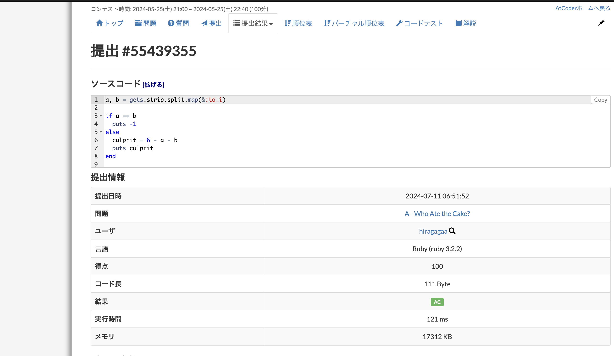
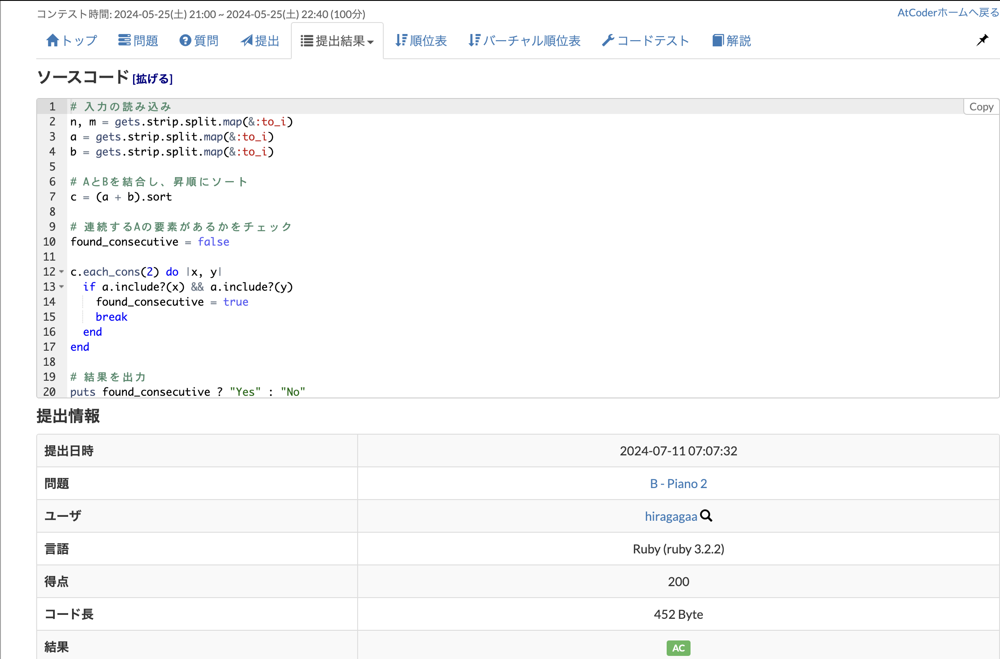
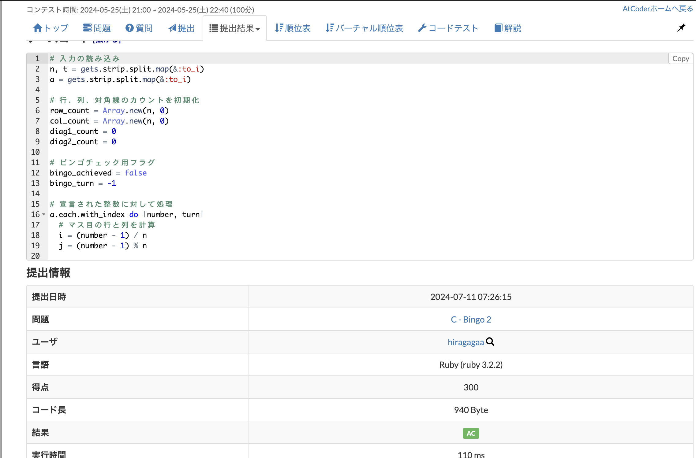

A問題
https://atcoder.jp/contests/abc355/tasks/abc355_a

B問題
https://atcoder.jp/contests/abc355/tasks/abc355_b

memo
    each_cons:連続した n 個の要素を1つずつずらしながら取得

C問題
https://atcoder.jp/contests/abc355/tasks/abc355_c

