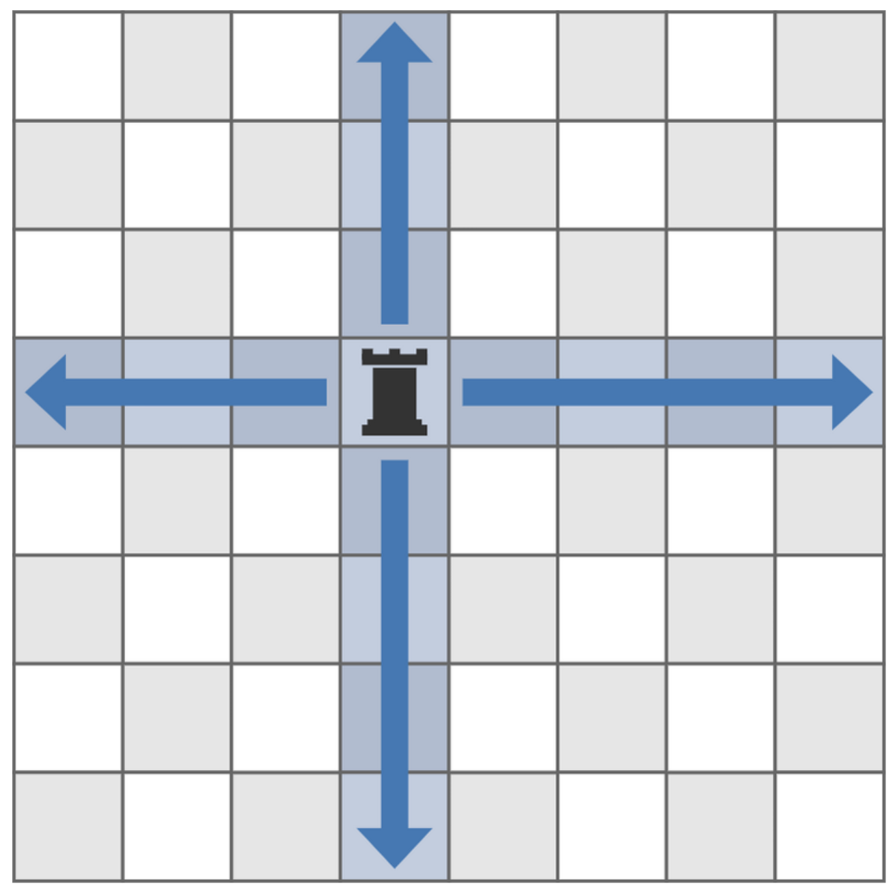

# ABC377 B - Avoid Rook Attack

## 問題
https://atcoder.jp/contests/abc377/tasks/abc377_b

### 問題文

縦 **8 マス**、横 **8 マス**の **64 マス**からなるマス目があります。  
上から **i 行目 (1 ≤ i ≤ 8)**、左から **j 列目 (1 ≤ j ≤ 8)** のマスをマス **(i, j)** と呼ぶことにします。

---

それぞれのマスは、以下のいずれかの状態です：
- 空マス
- コマが置かれているマス

---

マスの状態は、長さ **8** の文字列からなる長さ **8** の列  
**(S1, S2, S3, …, S8)** で表されます。

- マス **(i, j)** は次のように状態が決まります：
  - **Si の j 文字目が `.`** のとき → **空マス**。
  - **Si の j 文字目が `#`** のとき → **コマが置かれているマス**。

---

すでに置かれているどのコマにも取られないように、  
いずれかの空マスに自分のコマを置きたいです。

---

マス **(i, j)** に置かれているコマは、次のいずれかの条件を満たすコマを取ることができます：

1. **i 行目**のマスに置かれているコマ。
2. **j 列目**のマスに置かれているコマ。

---

たとえば、マス **(4, 4)** に置かれているコマは、  
以下の図で青く示されたマスに置かれているコマを取ることができます。

---

あなたがコマを置くことができるマスがいくつあるかを求めてください。

### 制約

- Si は ., # からなる長さ 8 の文字列 ( 1 ≤ i ≤ 8 )

### 入力

入力は以下の形式で標準入力から与えられる。

S1
​S2
​S3
​S4
​S5
​S6
S7
​S8
​
### 出力

すでに置かれているコマに取られずに自分のコマを置くことができる空マスの個数を出力せよ。

## 提出結果

https://atcoder.jp/contests/abc377/submissions/61331355
